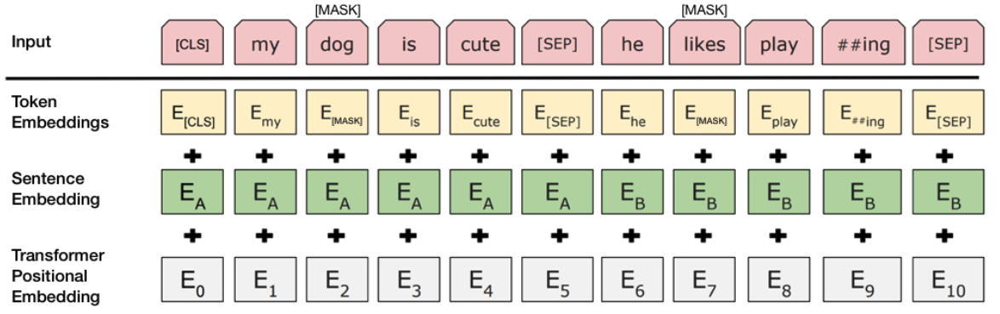

import { CopyBlock, dracula } from "react-code-blocks";

# Let's Play with Emotions!

In today’s tutorial, we will play with emotions, quite literally! With the growing trends in machine learning and importance to emulate human character/ traits by machines, it is vital that we understand the importance of emotion in our day to day life. In today’s world, emotional context can be applied to every aspect of our life, be it a morning meme you scroll through to , or the serenity in music, or a kid describing his first day at the guitar class! 

#####   *"The point I would like to make here is :  Information when analysed for emotion, can often reveal surprising traits!”*

Recommender systems use this underlying trait to provide best class and relevant suggestions. From Amazon to Youtube, the product recommendations to the next autoplay video, emotions are consumed in every step! Hard to believe? Go try it yourself !

                            source: unsplash.com

## Problem at Hand

Before we dive into emotional classification, let us understand sentiment analysis and how emotions are linked to it. Sentiment analysis is an effective method to portray sentiment polarity. Consider a movie review or a product review, sentiment analysis is used to capture public sentiment in reaction to a particular brand, which in turn influences future business decisions.  If you like a movie, or favor a product, you will talk positively about it. This inturn will drive sales or increase viewership in case of a movie. However, a definite flaw in this method is that we can categorize a text either into positive/negative class, when there are so many possible emotions attached to it. A positive or a negative review does not justify the emotions attached to it. A movie you liked or you loved will still be categorized as a positive sentiment. However, it misses the intensity of liking towards the movie.  The answer to this problem is Emotion Classification and today we are going to drill on that a bit. So with a cheerful face, let’s begin!

## The Emotional data

Consider a sentence :** *‘I wish I could go to play today’* **. Now if someone asks you what is the emotion exhibited here, I am sure you would say :sadness:. However, on looking closely, you will notice that the sentence has no negative word that can help the model classify it as a ** “sad” ** sentence. This is the first challenge we face in emotion classification!  Adding to this, it is tricky to teach machines sarcasm,irony and indirect meanings! 

Today we will deal with a document dataset created by [the hugging team ](https://huggingface.co/). Dataset has three files, split into training, test and validation sets. An example of the data is as below : 

<CopyBlock
language={"python"}
text={ `i feel like I am still looking at a blank canvas blank pieces of paper;sadness`}
showLineNumbers={false}
theme={dracula}
wrapLines={true}
codeBlock />

The dataset has ** 20000 ** rows with ** 6 ** different possible classes namely: ** Anger, Fear, Joy, Love, Sadness, Surprise. **

## Approach to Emotional Classification

We can build good sentiment classifiers even with only reasonably modest-size label training sets. Plethora of pre-trained word embeddings are readily available such as Word2Vec, GloVe, Fasttext, ConceptNet NumberBatch, etc. However, these embeddings are  non-polysemic in nature, translating to only one representation of a word despite its occurrence in different contexts. Considering this shortcoming, in this scope, we will explore embeddings from Google’s BERT model. 

## What is the BERT model?

BERT stands for Bidirectional Encoder Representations from Transformers and is a NLP model developed by Google for pre-training language representations. It leverages an enormous amount of plain text data publicly available (Wikipedia and Google Books) on the web and is trained in an unsupervised manner. It is a powerful model that is trained to learn the language structure and it’s nuances by training a Language Model. BERT has a deep bi-directional structure to it unlike ELMo, which is a shallow bi-directional and OpenAI GPT which is uni-directional in nature. Bidirectional nature helps the model to capture the context from previous words and words ahead of it any given time . I would recommend [reading this](https://jalammar.github.io/illustrated-bert/) in order to understand functionality of BERT even better.

***But first, setup: ***

#### Exploiting Google Colab GPU

Google Colab offers free GPUs and TPUs! BERT models consume huge memory and to aid it, it is advisable to take advantage of GPU. 

<CopyBlock
language={"python"}
text={ `device = torch.device("cuda" if torch.cuda.is_available() else "cpu")
num_gpu = torch.cuda.device_count()
torch.cuda.get_device_name(0)
SEED = 9
random.seed(SEED)
np.random.seed(SEED)
torch.manual_seed(SEED)
if device == torch.device("cuda"):
    torch.cuda.manual_seed_all(SEED) `}
showLineNumbers={false}
theme={dracula}
wrapLines={true}
codeBlock />

** Note: **  For torch to use the GPU, we need to identify and specify the GPU as the device. This will mainly come into picture when we train the model. Ayt that time, we will load the data onto the device.

Next, let’s install the [transformers](https://github.com/huggingface/transformers) package from Hugging Face which will give us a pytorch interface for working with BERT.At the moment, the Hugging Face library seems to be the most widely accepted and powerful pytorch interface for working with BERT. In addition to supporting a variety of different pre-trained transformer models, the library also includes pre-built  modifications of these models suited to your specific task. For example, in this tutorial we will use **BertForSequenceClassification**.

<CopyBlock
language={"python"}
text={ `!pip install transformers`}
showLineNumbers={false}
theme={dracula}
wrapLines={true}
codeBlock />

## Preprocessing the Data

Once we download and parse our data, it is time to encode our labels set. BEfore we encode our classes, we need to merge the three files to have the same label encoding.  

<CopyBlock
language={"python"}
text={ `df = pd.concat([df_train,df_test,df_val])`}
showLineNumbers={false}
theme={dracula}
wrapLines={true}
codeBlock />

We will use the LabelEncoder from sckit package.

<CopyBlock
language={"python"}
text={ `labelencoder = LabelEncoder()
df['label_enc'] = labelencoder.fit_transform(df['label'])`}
showLineNumbers={false}
theme={dracula}
wrapLines={true}
codeBlock />

Let’s extract the sentences and labels of our training set as numpy ndarrays.

<CopyBlock
language={"python"}
text={ `sentences = df.sentance.values
labels = df.label.values
`}
showLineNumbers={false}
theme={dracula}
wrapLines={true}
codeBlock />

 
  

## Tokenization and Attention Masks

BERT models take in a specific format. In order to do so, we need to transform our data into tokens.

                        
                          Source: BERT [Devlin et al., 2018], with modifications

The input text to BERT must be split into tokens, further on these tokens must be mapped to their index in the tokenizer vocabulary. Tokenization is performed using the tokenizer provided with BERT. 

 
<CopyBlock
language={"python"}
text={ `MAX_LEN = 256
tokenizer = BertTokenizer.from_pretrained('bert-base-uncased',do_lower_case=True)
input_ids = [tokenizer.encode(sent, add_special_tokens=True,max_length=MAX_LEN,pad_to_max_length=True) for sent in sentences]
labels = df.label.values`}
showLineNumbers={false}
theme={dracula}
wrapLines={true}
codeBlock />

As you must have noticed, we had **`add_special_tokens=True` **

At the end of every sentence, we need to append the special [SEP] token and prepend the special [CLS] token to the beginning of every sentence.

[SEP] is used mainly to separate two sentences and describe something among them. Eg: Is A and B related to one another .
[CLS] has special importance in the classification task. 
The final hidden state corresponding to this token is used as the aggregate sequence representation for classification tasks.”

Next important parameter is the **`max_length`** .

Did you notice how each input sentence has a varying length. In order to handle this variation, we can either append, or truncate to a single, fixed length. The maximum sentence length, BERT can handle is 512 tokens. In our case, we will restrict the max length to  256 tokens. For a sentence smaller than 256 tokens, the remaining space is padded with [PAD] token with index 0 in BERT vocabulary.

Now that we have tokenized  and added special tokens, we need to let BERT know where to pay attention. This is done via an attention mask. The “Attention Mask” is simply an array of 1s and 0s indicating which tokens are padding and which aren’t. Further reading can be done [here](https://huggingface.co/transformers/) to get a better understanding of this.

 
<CopyBlock
language={"python"}
text={ `## Create attention mask
attention_masks = []
## Create a mask of 1 for all input tokens and 0 for all padding tokens
attention_masks = [[float(i>0) for i in seq] for seq in input_ids] `}
showLineNumbers={false}
theme={dracula}
wrapLines={true}
codeBlock />

## Train and Validation Split

Divide up our training set to use 90% for training and 10% for validation.

 
<CopyBlock
language={"python"}
text={ `train_inputs,validation_inputs,train_labels,validation_labels = train_test_split(input_ids,labels,random_state=41,test_size=0.1)
train_masks,validation_masks,_,_ = train_test_split(attention_masks,input_ids,random_state=41,test_size=0.1) `}
showLineNumbers={false}
theme={dracula}
wrapLines={true}
codeBlock />

## Pytorch Data Types and Data loaders

The numpy.ndarrays needs to be converted into pytorch tensors. Later on we need to wrap them in a data loader . This would help us save memory during training. We do need to iterate over the entire dataset and load in memory at once. Notice how we have two data loaders defined for training and validation.

<CopyBlock
language={"python"}
text={ `# convert all our data into torch tensors, required data type for our model
train_inputs = torch.tensor(train_inputs)
validation_inputs = torch.tensor(validation_inputs)
train_labels = torch.tensor(train_labels)
validation_labels = torch.tensor(validation_labels)
train_masks = torch.tensor(train_masks)
validation_masks = torch.tensor(validation_masks)`}
showLineNumbers={false}
theme={dracula}
wrapLines={true}
codeBlock />

 
<CopyBlock
language={"python"}
text={ `batch_size = 32
train_data = TensorDataset(train_inputs,train_masks,train_labels)
train_sampler = RandomSampler(train_data)
train_dataloader = DataLoader(train_data,sampler=train_sampler,batch_size=batch_size)
## validation dataloader
validation_data = TensorDataset(validation_inputs,validation_masks,validation_labels)
validation_sampler = RandomSampler(validation_data)
validation_dataloader = DataLoader(validation_data,sampler=validation_sampler,batch_size=batch_size)`}
showLineNumbers={false}
theme={dracula}
wrapLines={true}
codeBlock />

## Bert For Sequence Classification

Now that we have the right data format and our data loader is ready , it is time to train the model. We will use the classification model from BERT. .For classification, the normal BERT model is added with a single linear layer on top for classification. 

                           source: jalammar.github.io/illustrated-bert/

We load the BERT **`bert-base-uncased`** . uncased refers to lowercase while base refers to the smaller version model .
In transformers, optimizer and schedules are instantiated like this

<CopyBlock
language={"python"}
text={ `model = BertForSequenceClassification.from_pretrained("bert-base-uncased", num_labels=6).to(device) `}
showLineNumbers={false}
theme={dracula}
wrapLines={true}
codeBlock />

### Setting up Hyperparamters

1. Batch size: 32
2. Learning rate : 2e-5
3. Epochs : 2
4. Epsilon : 1e-8 (to avoid small number division by zero)

<CopyBlock
language={"python"}
text={ `optimizer = AdamW(model.parameters(), lr=lr,eps=adam_epsilon,correct_bias=False)  # To reproduce BertAdam specific behavior set correct_bias=False
scheduler = get_linear_schedule_with_warmup(optimizer, num_warmup_steps=num_warmup_steps, num_training_steps=num_training_steps)`}
showLineNumbers={false}
theme={dracula}
wrapLines={true}
codeBlock />

## Let the Training Begin!

For each pass, we have a training and a validation phase. Let us understand the core of each of these phases.

#### Training:

1. Unpack the data and labels from the iterator
2. Loading the data on the GPU (to.device)
3. Clearing the gradients from previous pass
4. Forward pass through the model
5. Backward pass
6. Updating model parameters (optimizer.step())
7. Save variables for each step/epoch monitoring

#### Validation:

1. Unpack the data and labels from the iterator
2. Loading the data on the GPU (to.device)
3. Forward pass through the model
4. Compute Loss on the validation data
5. Save variables for each step/epoch monitoring

Now that the training flow is understood, let us look at the code.

<CopyBlock
language={"python"}
text={ `for _ in tnrange(1,epochs+1,desc='Epoch'):
  print("<" + "="*22 + F" Epoch {_} "+ "="*22 + ">")
  # Calculate total loss for this epoch
  batch_loss = 0
  for step, batch in enumerate(train_dataloader):
    # Set our model to training mode (as opposed to evaluation mode)
    model.train()
    
    # Add batch to GPU
    batch = tuple(t.to(device) for t in batch)
    
    # Unpack the inputs from our dataloader
    b_input_ids, b_input_mask, b_labels = batch
    
    # Forward pass
    outputs = model(b_input_ids, token_type_ids=None, attention_mask=b_input_mask, labels=b_labels)
    loss = outputs[0]
    
    # Backward pass
    loss.backward()
    
    # Clip the norm of the gradients to 1.0
    # Gradient clipping is not in AdamW anymore
    torch.nn.utils.clip_grad_norm_(model.parameters(), 1.0)
    
    # Update parameters and take a step using the computed gradient
    optimizer.step()
    
    # Update learning rate schedule
    scheduler.step()
    
    # Clear the previous accumulated gradients
    optimizer.zero_grad()
    
    # Update tracking variables
    batch_loss += loss.item()           
  # Calculate the average loss over the training data.
  avg_train_loss = batch_loss / len(train_dataloader)
  #store the current learning rate
  
  for param_group in optimizer.param_groups:
    print("\n\tCurrent Learning rate: ",param_group['lr'])
    learning_rate.append(param_group['lr'])
    train_loss_set.append(avg_train_loss)
  print(F'Average Training loss: {avg_train_loss}')
  
  # Validation
  
  # Put model in evaluation mode to evaluate loss on the validation set
  model.eval()
  
  # Tracking variables 
  eval_accuracy,eval_mcc_accuracy,nb_eval_steps = 0, 0, 0
  # Evaluate data for one epoch
  for batch in validation_dataloader:
    # Add batch to GPU
    batch = tuple(t.to(device) for t in batch)
    # Unpack the inputs from our dataloader
    b_input_ids, b_input_mask, b_labels = batch
    # Telling the model not to compute or store gradients, saving memory and speeding up validation
    with torch.no_grad():
      # Forward pass, calculate logit predictions
      logits = model(b_input_ids, token_type_ids=None, attention_mask=b_input_mask)
    
    # Move logits and labels to CPU
    logits = logits[0].to('cpu').numpy()
    label_ids = b_labels.to('cpu').numpy()
    
    pred_flat = np.argmax(logits, axis=1).flatten()
    
    labels_flat = label_ids.flatten()
    df_metrics=pd.DataFrame({'Epoch':epochs,'Actual_class':labels_flat,'Predicted_class':pred_flat})
    
    tmp_eval_accuracy = accuracy_score(labels_flat,pred_flat)
    tmp_eval_mcc_accuracy = matthews_corrcoef(labels_flat, pred_flat)
    
    eval_accuracy += tmp_eval_accuracy
    eval_mcc_accuracy += tmp_eval_mcc_accuracy
    
    nb_eval_steps += 1
  
  print(F'Validation Accuracy: {eval_accuracy/nb_eval_steps}')
  print(F'Validation MCC Accuracy: {eval_mcc_accuracy/nb_eval_steps}')`}
showLineNumbers={false}
theme={dracula}
wrapLines={true}
codeBlock />

Currently we have performed no hyperparameter tuning. Adjustments can be made in altering the learning rate, epochs, batch size, ADAM properties . I leave them for you to test and find the best set. Do let me know if you find some crazy differences. Note, how we did not train on the entire training dataset and kept  aside a portion of it as our validation set for legibility of code. Another thing that impacts the overall performance is the random seed. Maybe, play with that too and notice the results. Finally, you can find the entire code on Github.

