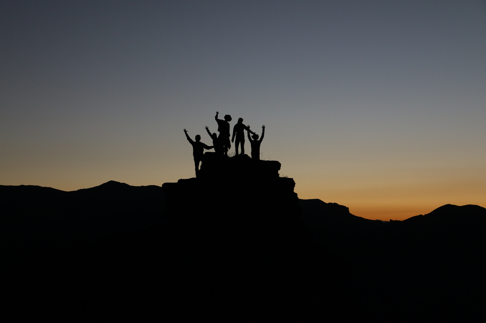

import { CopyBlock, dracula } from "react-code-blocks";

# My 3 strategies for leading through these uncertain times!

   

If there was ever any doubt about the importance of a leader’s ability to navigate change, 
uncertainty, and disruption, the emergence of the global pandemic in 2020 made this necessity 
abundantly clear. And while we all hope to avoid future pandemics, one thing is certain — we cannot 
avoid ever-increasing complexity. Understandably, it’s easy to feel this way when the complexity of 
our world has surpassed our “complexity of mind,” as Robert Kegan and Lisa Lahey describe in their book, 
[Immunity to Change](https://www.amazon.com/Immunity-Change-Potential-Organization-Leadership/dp/1422117367/ref=tmm_hrd_swatch_0?_encoding=UTF8&qid=1614040887&sr=1-1). 
To put this in concrete terms, computing power has increased more than a [trillion-fold](https://www.visualcapitalist.com/visualizing-trillion-fold-increase-computing-power/)
since the mid-1950s, but our brains remain unchanged.

 

                            source : unsplash.com
   

Every week provides enough reminders that leaders cannot control the degree of change, uncertainty, and 
complexity happening in the world currently. In order to improve the ability to grow and navigate effectively,
it is important to embrace the change. The discomfort should be tackled with a "learn it all" mindset. 
This shall take the pressure off of you to have all the answers. Let us talk about three strategies that 
can accelerate your ability to continually learn, evolve, and navigate progressively more complex challenges. 

   

## Don't let Perfectionism be the roadblock to Productivity

In the current complex environment, the context is continually shifting; thus, aiming for perfection is futile.
Instead, aim for advancements and progress, expect mistakes and recognize them early. It is needed to continually
course-correct while you unlearn and learn. 

For strong-achievers, prone to perfectionism, egos and desired 
identities (e.g., of being successful or being “the expert”) can get in the way. In order for you to let go 
of perfectionism,  it is vital to identify and acknowledge your specific core fears that are triggered. 
*** “I’ll fail,”, “I’ll look bad,” or “I’ll make the wrong decision.” *** are not worry signs, instead they are 
awareness-creating thoughts, that will help you rethink and make better decisions. Loosening the grip of these 
assumptions over time can allow you to let go of perfectionism and accept that mistakes and failure are to be expected along the way.

   

## Look for the Bigger Picture - Zoom Out

Leaders often get dissolved with time in the challenges they face because they are too immersed in them.
*** “Zooming out,” or moving from “the dance floor to the balcony,” *** as described by Ron Heifetz, 
Marty Linksy, and Alexander Grashow in [The Practice of Adaptive Leadership](https://www.amazon.com/Practice-Adaptive-Leadership-Changing-Organization/dp/1422105768/ref=sr_1_3?dchild=1&keywords=ron+heifetz&qid=1617760216&sr=8-3) provides you with a wider 
perspective and an eagle's eye view of the problem statement and can often highlight on unexamined 
assumptions that would otherwise not be considered. 

From this “balcony” or elevated vantage point, 
interdependencies and larger patterns become visible, potentially revealing unforeseen obstacles and 
new solutions. Looking at this bigger picture often helps you solve the fundamental problems which would 
have been missed otherwise. Making a regular practice of conducting this dance floor-balcony shift, you 
can build your capacity to see the bigger picture and become more agile.

   

## No riding Alone

Often leaders are found in isolation. Part of this isolation comes from an implicit belief that they need 
to solve all of the issues by themselves. However, as the complexity and volume of the workload increase, 
our natural tendency is to increase the focus with one task at a time. While the challenges are short-term
with known solutions, the strategy works wonders. However, while the challenges are filled with 
interdependencies and huge issues, the strategy can be a disaster. At a crucial point like this,
it is extremely important to cultivate the practice of intentionally reaching out to your network 
and beyond for insight and perspective.

As a CEO of a multi-billion-dollar company once explained "When I’m trying to make sense of a complex issue,
the first thing I do is reach out to people whose opinion I value and whose experience is in some ways 
different from mine. It is fun to see their point of view?"

He went on to explain,*** “It’s not so much that I expect them to have an answer, as I want to plug into their 
thinking and their sources.” ***

 